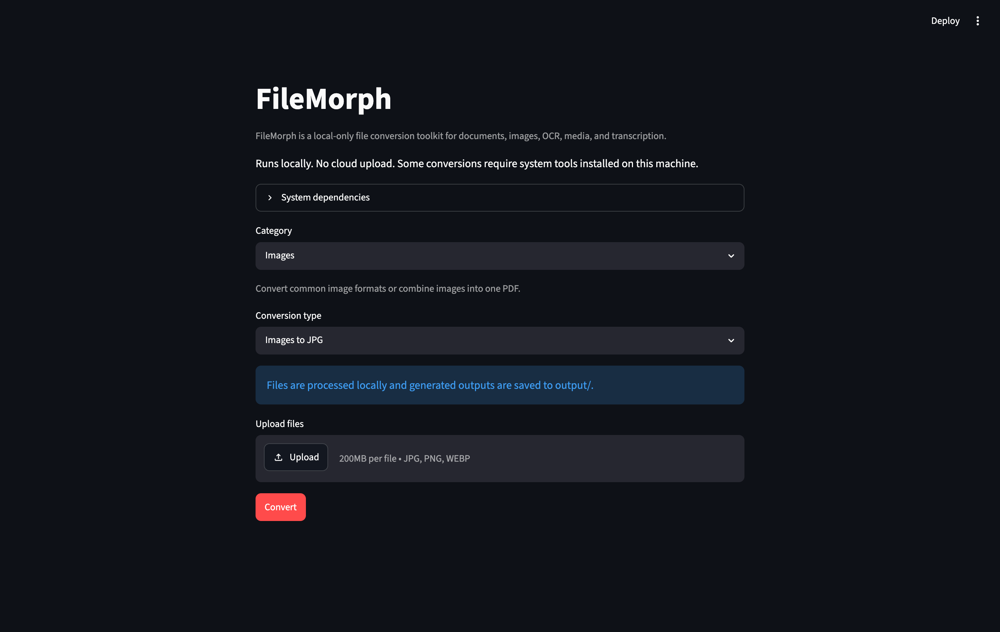
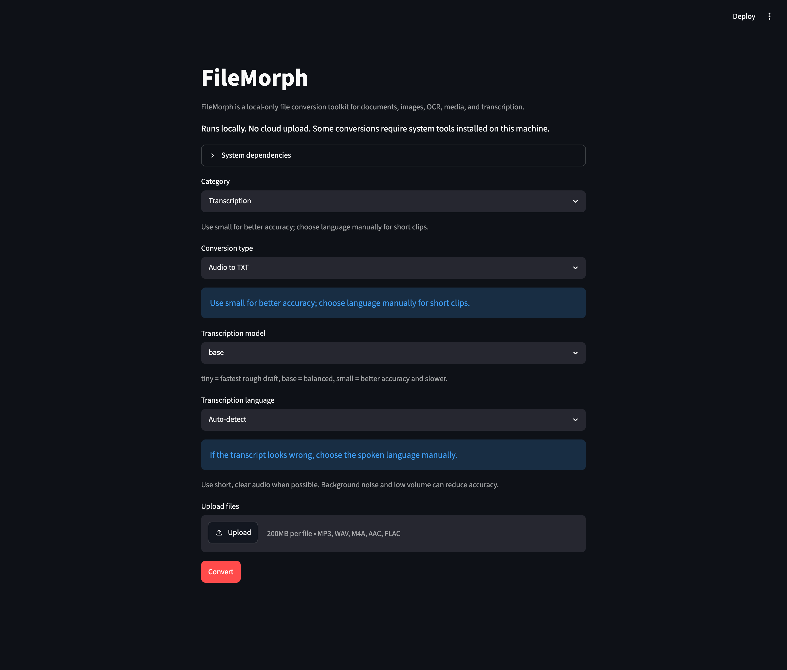

# FileMorph

FileMorph is a local-first file conversion toolkit with a native macOS desktop
app and online demo deployment support. It converts documents, images, PDFs,
scanned files, presentations, audio, and video.

The project is designed for practical everyday workflows: batch uploads, clear
conversion choices, local output folders, downloadable results, and deployment
files for sharing a demo with other people.

## Preview





## What It Can Do

| Area | Supported workflows |
| --- | --- |
| Images | Convert JPG, JPEG, PNG, WEBP, HEIC, and HEIF; combine images into one PDF; create one PDF per image. |
| PDF | Convert pages to PNG, extract selectable text to TXT, and create DOCX drafts. |
| OCR | Extract text from images and scanned PDFs with local Tesseract OCR. |
| Office | Convert PPTX to PDF or DOCX, including slide-image and mixed-output modes. |
| Media | Extract WAV or MP3 audio from video files. |
| Transcription | Transcribe local audio or video to timestamped TXT with faster-whisper. |
| Batch workflow | Upload multiple files, track progress, download individual outputs, or download a ZIP. |

## Why This Project Is Useful

- **Local Mac app:** the Mac build starts Streamlit as an internal localhost
  service and embeds it in a FileMorph WebView window. It does not open Safari,
  Chrome, Edge, or the system browser.
- **Local-first by default:** private files stay on your machine in the desktop
  build.
- **Demo-ready:** deploy with Docker, Render, Railway, Fly.io, or Streamlit
  Community Cloud.
- **Practical conversion stack:** uses proven local tools such as Poppler,
  Tesseract, LibreOffice, ffmpeg, and faster-whisper.
- **Tested helper logic:** conversion routing, history, output metadata, previews,
  and batch behavior are covered by unit tests.

## Quick Start For Mac Users

For most Mac users, download one of the release installers from GitHub Releases:

- `FileMorph-macOS.dmg`: open the disk image, then drag `FileMorph.app` to
  `Applications`.
- `FileMorph-Installer.pkg`: double-click the installer package and follow the
  macOS installer.

Both install the same local WebView app at:

```text
/Applications/FileMorph.app
```

If macOS blocks the app the first time, right-click `FileMorph.app`, choose
Open, then confirm that you want to run it.

## Build From Source

Source users can create the desktop runtime and install the local Mac app:

```bash
python -m venv .venv
.venv/bin/python -m pip install -r requirements-desktop.txt
```

Install into `/Applications`:

```bash
./scripts/install_macos_app.sh
```

Then double-click:

```text
/Applications/FileMorph.app
```

Build release installers:

```bash
./scripts/build_macos_dmg.sh
./scripts/build_macos_pkg.sh
```

These create release artifacts in `dist/`:

```text
dist/FileMorph-macOS.dmg
dist/FileMorph-Installer.pkg
```

The installed app carries a source snapshot inside:

```text
FileMorph.app/Contents/Resources/FileMorph/source/
```

The installer bundles the project `.venv` inside the app. The bundled runtime
must include `pywebview`, so the app can open its own macOS window offline:

```text
FileMorph.app/Contents/Resources/FileMorph/.venv/
```

Its runtime files live outside the app bundle in:

```text
~/Library/Application Support/FileMorph/
```

That folder contains `uploads/`, `output/`, and logs. The app does not install
key dependencies on first launch.

The desktop app and the online demo share the same UI entry point:
`app/main.py`. The difference is where it runs: locally inside
`FileMorph.app`, or remotely on a demo server.

GitHub uploads should include the source code and documentation, but not local
runtime artifacts such as `.venv/`, `dist/`, `uploads/`, `output/`, or `logs/`.
Those paths are ignored by `.gitignore`. Publish `.dmg` and `.pkg` files as
GitHub Release artifacts, not as committed repository files.

## Local Developer Start

Create a Python environment:

```bash
python -m venv .venv
source .venv/bin/activate
python -m pip install -r requirements.txt
```

For macOS desktop development, install the desktop runtime:

```bash
python -m pip install -r requirements-desktop.txt
```

Install the full macOS conversion toolchain:

```bash
brew install poppler tesseract tesseract-lang ffmpeg
brew install --cask libreoffice
```

Run the web demo locally:

```bash
streamlit run app/main.py
```

Run tests:

```bash
python -m pytest -q
```

## Online Demo Deployment

FileMorph includes deployment files for hosted demos:

- `Dockerfile` for Render, Railway, Fly.io, or a server that supports Docker.
- `render.yaml` for Render Blueprint deployment.
- `packages.txt` for Streamlit Community Cloud system packages.
- `DEPLOYMENT.md` with detailed local and hosted deployment notes.

Docker quick check:

```bash
docker build -t filemorph .
docker run --rm -p 8501:8501 filemorph
```

Then open:

```text
http://127.0.0.1:8501
```

Online mode sets `FILEMORPH_RUNTIME=online`, so the app shows a server-side
upload privacy note instead of the local-only note.

## Privacy Model

Local mode:

- Uploaded files are written to `uploads/`.
- Converted files are written to `output/`.
- The app binds to `127.0.0.1`.
- No cloud API is used by the default local launcher.

Online demo mode:

- Uploaded files are stored on the remote server running the app.
- Use demo/non-sensitive files unless you add authentication, cleanup jobs, and
  storage controls.
- Heavy workflows may be limited by the hosting plan's CPU, memory, disk, and
  request timeout limits.

## System Dependencies

| Dependency | Required for | macOS install command |
| --- | --- | --- |
| Poppler | PDF to PNG, scanned PDF OCR, PPTX slide-image DOCX | `brew install poppler` |
| Tesseract | Image OCR, scanned PDF OCR | `brew install tesseract` |
| Tesseract language data | Chinese OCR language options | `brew install tesseract-lang` |
| LibreOffice | PPTX to PDF, PPTX slide-image DOCX | `brew install --cask libreoffice` |
| ffmpeg | Video to Audio, Video to TXT, audio preprocessing | `brew install ffmpeg` |
| faster-whisper | Audio to TXT, Video to TXT | `python -m pip install -r requirements.txt` |

## Project Structure

```text
app/
  converters/      Conversion implementations
  services/        File saving, output naming, ZIP helpers
  main.py          Streamlit web demo UI and workflow orchestration
desktop/
  main.py          Local WebView launcher for the shared Streamlit UI
scripts/
  build_macos_app.sh         Build dist/FileMorph.app
  build_macos_dmg.sh         Build dist/FileMorph-macOS.dmg
  build_macos_pkg.sh         Build dist/FileMorph-Installer.pkg
  create_macos_icon.py       Generate the macOS app icon
  install_macos_app.sh       Install FileMorph into /Applications
tests/             Unit tests for converters and UI helpers
```

## Current Limitations

- OCR and transcription quality depends on source clarity, noise, volume,
  language selection, and installed language data.
- PPTX to DOCX layout preservation is best in Slide Images mode; editable Text
  Outline mode does not reproduce the original slide layout.
- The first transcription may download the selected Whisper model.
- HEIC/HEIF input requires `pillow-heif`.
- Long videos and large PDFs can take time to process.
- Online deployments need extra cleanup/storage controls before handling
  sensitive files.
- The macOS app is a local WebView wrapper around the shared Streamlit UI, not a
  browser tab and not the online deployment.

## License

MIT License. See `LICENSE`.
