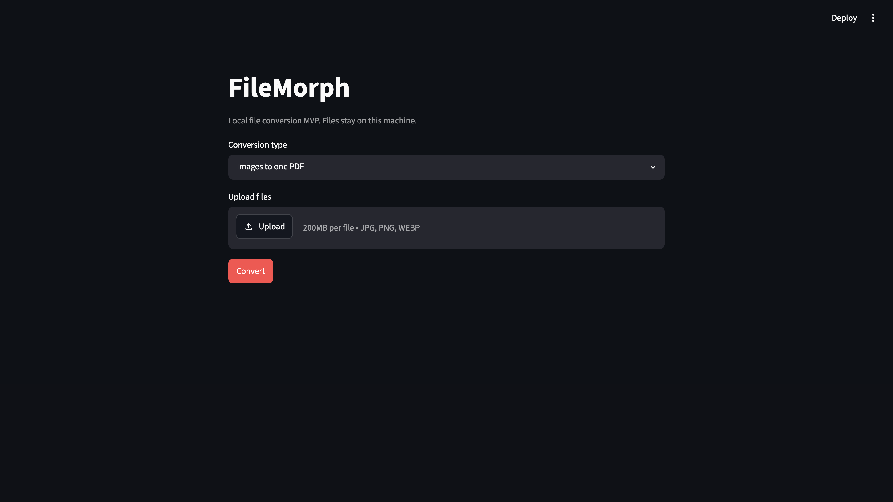
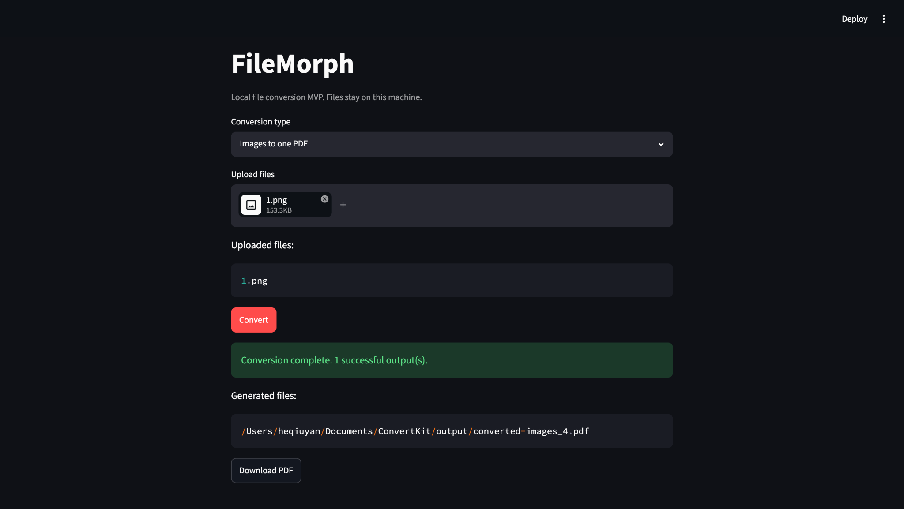

# FileMorph

FileMorph is a local-only Streamlit file conversion toolkit for documents, images, OCR, media, and transcription. It is built for practical desktop workflows where files stay on your machine and generated outputs are saved to `output/`.

## Local-Only Privacy Note

FileMorph runs locally. Uploaded files are written to the local `uploads/` directory, converted files are written to `output/`, and no cloud APIs or external upload services are used by the app.

## Features

| Group | Features |
| --- | --- |
| Images | Batch JPG, JPEG, PNG, and WEBP conversion; combine images into one PDF. |
| PDF | Convert PDF pages to PNG, extract selectable PDF text to TXT, convert PDF to DOCX. |
| OCR | Extract text from images and scanned PDFs with local Tesseract OCR. |
| Office | Convert PPTX to PDF; convert PPTX to DOCX as editable outline, slide images, or mixed output. |
| Media | Extract WAV or MP3 audio from video files. |
| Transcription | Transcribe local audio and video files to timestamped TXT with faster-whisper. |

## Demo

FileMorph supports local-only conversion. Users can upload files, convert them locally, preview generated TXT output when applicable, and download generated files from the app.

## Screenshots

### Main UI



### Successful Conversion



## Quick Start

1. Clone the repository:

```bash
git clone <repository-url>
cd ConvertKit
```

2. Create and activate a Python environment:

```bash
python -m venv .venv
source .venv/bin/activate
```

3. Install Python dependencies:

```bash
python -m pip install -r requirements.txt
```

4. Install system dependencies for the workflows you need. On macOS, the full local toolchain is:

```bash
brew install poppler tesseract tesseract-lang ffmpeg
brew install --cask libreoffice
```

5. Run Streamlit:

```bash
streamlit run app/main.py
```

Then open the local Streamlit URL shown in the terminal.

Run tests with:

```bash
python -m pytest -q
```

## Supported Conversions

| Source | Target | Batch support | Notes |
| --- | --- | --- | --- |
| JPG, JPEG, PNG, WEBP | JPG | Yes | Alpha channels are flattened onto white for JPG output. |
| JPG, JPEG, PNG, WEBP | PNG | Yes | Preserves a broadly compatible image output. |
| JPG, JPEG, PNG, WEBP | WEBP | Yes | Uses Pillow for local conversion. |
| JPG, JPEG, PNG, WEBP | Single PDF | Yes | Combines uploaded images into one PDF. |
| PDF | PNG pages | One or more PDFs | Requires Poppler to be installed locally. |
| PDF | TXT | One or more PDFs | Works best with text-based PDFs that contain selectable text. |
| PDF | DOCX | One or more PDFs | Uses `pdf2docx`; complex layouts may need manual cleanup. |
| PPTX | PDF | One or more PPTX files | Requires LibreOffice to be installed locally. |
| PPTX | DOCX | One or more PPTX files | Supports text outline, slide images, and mixed visual/text modes. |
| MP4, MOV, MKV, AVI | WAV, MP3 | One or more videos | Requires ffmpeg to be installed locally. |
| MP3, WAV, M4A, AAC, FLAC | TXT | One or more audio files | Uses local faster-whisper transcription. |
| MP4, MOV, MKV, AVI | TXT | One or more videos | Extracts WAV audio with ffmpeg, then transcribes locally. |
| JPG, JPEG, PNG, WEBP | TXT with OCR | Yes | Requires Tesseract to be installed locally. |
| Scanned PDF | TXT with OCR | One or more PDFs | Converts PDF pages to images, then runs OCR locally. |

## System Dependencies

| Dependency | Required for | macOS install command |
| --- | --- | --- |
| Poppler | PDF to PNG, scanned PDF OCR, PPTX slide-image DOCX | `brew install poppler` |
| Tesseract | Image OCR, scanned PDF OCR | `brew install tesseract` |
| Tesseract language data | Chinese OCR language options | `brew install tesseract-lang` |
| LibreOffice | PPTX to PDF, PPTX slide-image DOCX | `brew install --cask libreoffice` |
| ffmpeg | Video to Audio, Video to TXT, audio preprocessing | `brew install ffmpeg` |
| faster-whisper | Audio to TXT, Video to TXT | `python -m pip install -r requirements.txt` |

## Office Conversion

FileMorph can convert PPTX presentations to PDF through LibreOffice and can create DOCX files from PPTX presentations in multiple modes.

On macOS, install LibreOffice with:

```bash
brew install --cask libreoffice
```

PPTX to DOCX modes:

- Text Outline: extracts editable slide text into a Word outline with slide headings, titles, body text, and speaker notes when available. This is the original behavior and does not preserve the exact PowerPoint visual layout.
- Slide Images: renders each slide as an image and inserts the images into a DOCX file. This preserves slide appearance more closely, but the slide text inside the image is not editable.
- Slide Images + Extracted Text: inserts each slide image first, then adds extracted editable text below it.

Slide image modes use LibreOffice for PPTX-to-PDF rendering and Poppler for PDF page image export.

## Media Conversion

FileMorph can extract audio from local video files in MP4, MOV, MKV, and AVI formats. WAV is the default output, and MP3 is also available from the Streamlit UI.

On macOS, install ffmpeg with:

```bash
brew install ffmpeg
```

## Audio and Video Transcription

FileMorph can transcribe local audio files and video files to timestamped `.txt` output with `faster-whisper`. Audio is normalized locally to mono 16 kHz WAV before transcription. Video transcription first extracts WAV audio locally with ffmpeg, then normalizes and transcribes the extracted audio.

Transcription stays local after the model is available. The first run for a selected Whisper model may download model files to your local machine.

Model options:

- tiny: fastest, lowest accuracy.
- base: balanced default.
- small: slower, better accuracy.

Language options:

- Auto-detect: lets faster-whisper detect the language.
- English: uses `en`.
- Simplified Chinese: uses `zh`.

### Transcription Quality Tips

For better transcription results:

- Use `small` for better accuracy when speed is less important.
- Use `base` for balanced speed and quality.
- Use `tiny` only for quick rough drafts.
- Select English for English audio.
- Select Simplified Chinese for Chinese audio.
- Avoid Auto-detect for very short clips when possible.
- Use clear speech with low background noise.
- Avoid very quiet, distant, clipped, or music-heavy audio when possible.

Chinese transcription works better when Simplified Chinese is selected manually, especially for short clips. The first real transcription for a selected model may download model files locally.

## OCR Text Extraction

FileMorph supports local OCR for image files and scanned PDFs through `pytesseract` and the Tesseract command-line engine. OCR output is saved as plain `.txt` files in `output/`.

Supported OCR language options in the UI:

- English: `eng`
- Simplified Chinese: `chi_sim`
- Traditional Chinese: `chi_tra`
- English + Simplified Chinese: `eng+chi_sim`

On macOS, install Tesseract with:

```bash
brew install tesseract
```

For Chinese OCR language data, install the additional language package:

```bash
brew install tesseract-lang
```

Check installed OCR languages with:

```bash
tesseract --list-langs
```

### OCR Quality Tips

OCR works best with clear, high-resolution images and strong contrast. FileMorph includes three OCR modes:

- Standard OCR: sends the image to Tesseract with minimal preprocessing.
- Enhanced OCR for screenshots: upscales and increases contrast for screenshots, UI captures, and mixed text/code images.
- Enhanced OCR for scanned documents: upscales, increases contrast, and binarizes pages for document-style scans.

For best results:

- Use high-resolution images when possible.
- Avoid dark backgrounds when possible.
- Use English OCR for English text instead of mixed-language OCR unless the image really contains multiple languages.
- Install `tesseract-lang` for Chinese OCR.
- Expect screenshots with code, UI chrome, dense layouts, or dark themes to be imperfect.

## Current Limitations

- OCR quality depends on scan clarity, resolution, contrast, orientation, and installed language data.
- Transcription quality depends on speech clarity, microphone quality, background noise, volume, and language selection.
- Handwriting may be inaccurate or unreadable.
- Screenshots with code, UI elements, dark backgrounds, or mixed fonts may be imperfect.
- Complex tables, columns, and visual layouts are not preserved in OCR TXT output.
- OCR output is plain text, not formatted DOCX.
- PDF-to-PNG requires Poppler command-line tools in addition to Python packages.
- PDF-to-DOCX quality depends on the source PDF layout and may not perfectly preserve columns, tables, fonts, or spacing.
- PPTX-to-PDF requires LibreOffice.
- PPTX-to-DOCX Text Outline mode extracts editable slide text but does not preserve the exact visual slide layout.
- PPTX-to-DOCX Slide Images mode preserves appearance more closely, but text in the slide image is not editable.
- PPTX-to-DOCX Slide Images + Extracted Text mode includes both a visual slide preview and extracted editable text.
- PPTX-to-DOCX slide image modes require LibreOffice and Poppler.
- Video-to-audio requires ffmpeg.
- Audio and video transcription requires `faster-whisper`; the first run may download a selected Whisper model.
- Noisy audio, overlapping speakers, music, accents, and low bitrates can reduce transcription quality.
- Long videos may take time to extract and transcribe.
- Chinese transcription works better when the language is set to Simplified Chinese instead of Auto-detect.
- Uploaded source files remain in `uploads/` and generated files remain in `output/` until manually removed.
- The app is designed for local MVP usage, not multi-user hosted deployments.

## Roadmap

- Add cleanup controls for `uploads/` and `output/`.
- Add richer download controls for single output files.
- Add integration tests for PDF workflows with small fixture files.
- Add OCR-to-DOCX export as a future workflow.

## Troubleshooting

### Missing Python dependencies

If Streamlit or a converter reports a missing Python package such as `pypdf` or `pdf2image`, reinstall the project requirements from the repository root:

```bash
python -m pip install -r requirements.txt
```

### How to run the app

Install the requirements, then start Streamlit from the project root:

```bash
python -m pip install -r requirements.txt
streamlit run app/main.py
```

### PDF-to-PNG requires Poppler

PDF pages to PNG uses the Python package `pdf2image` plus the Poppler command-line tools. Installing `requirements.txt` covers the Python package, but Poppler must be installed separately. On macOS, install Poppler with:

```bash
brew install poppler
```

If Poppler is missing, FileMorph shows this message:

```text
PDF-to-PNG requires Poppler. On macOS, install it with: brew install poppler
```

### PPTX-to-PDF requires LibreOffice

PPTX-to-PDF uses LibreOffice through the `soffice` command-line tool. On macOS, install LibreOffice with:

```bash
brew install --cask libreoffice
```

If LibreOffice is missing, FileMorph shows this message:

```text
PPTX to PDF requires LibreOffice. On macOS, install it with: brew install --cask libreoffice
```

### PPTX-to-DOCX slide image modes require LibreOffice and Poppler

PPTX-to-DOCX Text Outline mode only needs the Python Office packages from `requirements.txt`. Slide Images and Slide Images + Extracted Text modes also render slides locally through LibreOffice and Poppler. On macOS, install them with:

```bash
brew install --cask libreoffice
brew install poppler
```

If slide image export is unavailable, FileMorph shows this message:

```text
PPTX slide image export requires LibreOffice and Poppler. On macOS, install them with: brew install --cask libreoffice and brew install poppler
```

### Video-to-audio requires ffmpeg

Video-to-audio uses the local `ffmpeg` command-line tool. On macOS, install ffmpeg with:

```bash
brew install ffmpeg
```

If ffmpeg is missing, FileMorph shows this message:

```text
Video to audio requires ffmpeg. On macOS, install it with: brew install ffmpeg
```

### Audio and video transcription requires faster-whisper

Audio-to-TXT and Video-to-TXT use `faster-whisper`. Installing `requirements.txt` covers the Python package, but the selected Whisper model may download on first use and then be cached locally.

```bash
python -m pip install -r requirements.txt
```

If faster-whisper is missing, FileMorph shows this message:

```text
Audio transcription requires faster-whisper. Install dependencies with: python -m pip install -r requirements.txt
```

If ffmpeg cannot prepare audio for transcription, FileMorph shows this message:

```text
Audio preprocessing failed. Make sure ffmpeg is installed and the file has a valid audio track.
```

### OCR requires Tesseract

Image OCR and scanned PDF OCR require the Python package `pytesseract` plus the local Tesseract binary. Installing `requirements.txt` covers the Python package, but Tesseract must be installed separately. On macOS, install it with:

```bash
brew install tesseract
```

For Chinese language OCR, also install:

```bash
brew install tesseract-lang
```

To check which OCR languages are installed locally, run:

```bash
tesseract --list-langs
```

If Tesseract is missing, FileMorph shows this message:

```text
OCR requires Tesseract. On macOS, install it with: brew install tesseract
```

If `chi_sim` or `chi_tra` is missing, the Streamlit UI will hide OCR options that require those languages and show this warning:

```text
Chinese OCR language packs are not installed. On macOS, run: brew install tesseract-lang
```

### Scanned PDFs and text extraction

TXT export works for text-based PDFs that contain selectable text. Scanned PDFs are usually images inside a PDF, so use the scanned PDF OCR option when selectable text is not available.

OCR has practical limits: scanned quality matters, handwriting may be inaccurate, complex tables and layouts are not preserved, and OCR TXT output is plain text rather than formatted DOCX.

### PDF-to-DOCX layout quality

PDF-to-DOCX conversion is handled by `pdf2docx` for the first MVP. Complex layouts, tables, columns, unusual fonts, and scanned pages may not convert perfectly because PDFs do not store document structure the same way DOCX files do.

## Project Structure

```text
app/
  main.py
  converters/
    image_converter.py
    media_converter.py
    ocr_converter.py
    office_converter.py
    pdf_converter.py
    transcription_converter.py
  services/
    file_service.py
audits/
docs/
  screenshots/
tests/
requirements.txt
README.md
```

## License

MIT License. See `LICENSE`.
